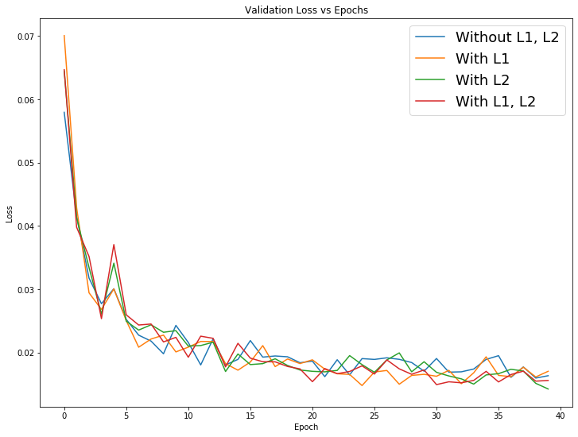
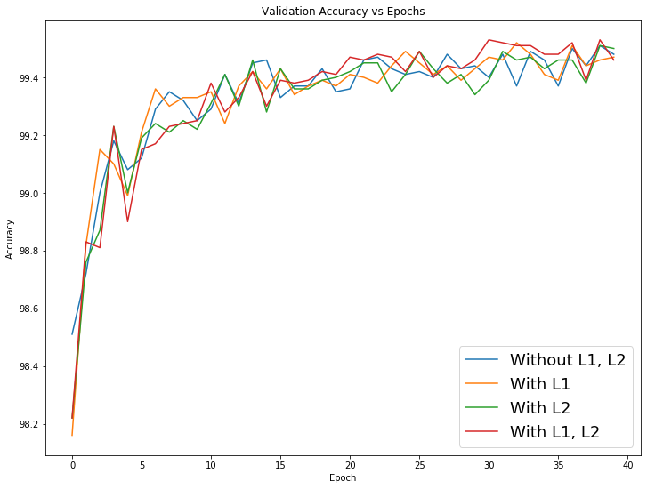
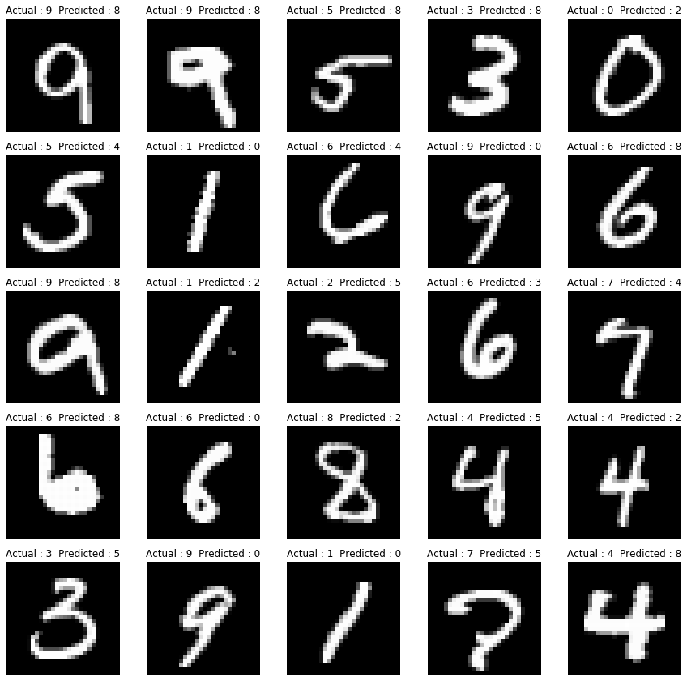
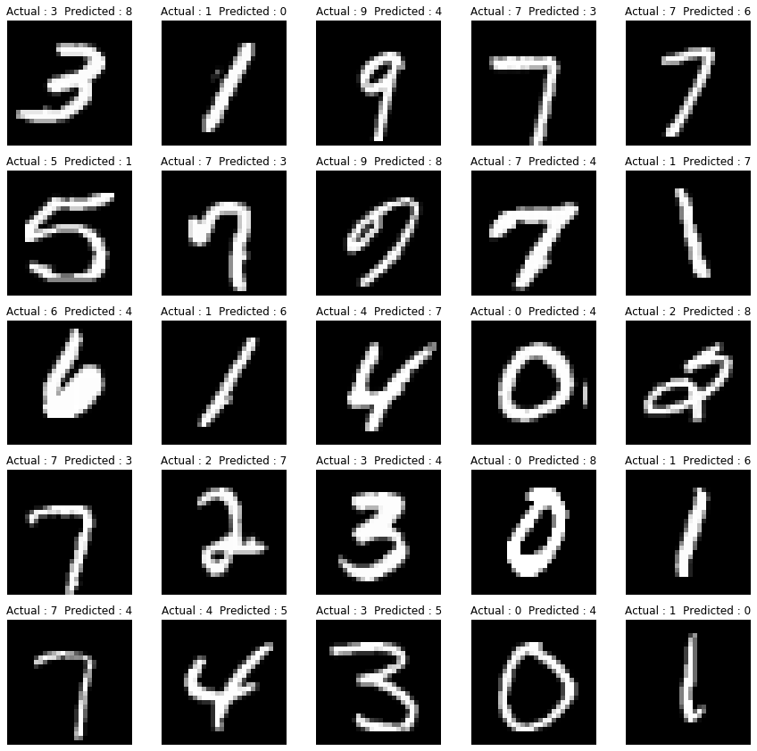

## About  
The notebook contains the logs of running the same model for 40 epochs with following criteria:
   * Without L1 and L2 Regularizations
   * With L1 Regularization
   * With L2 Regularization
   * With L1 and L2 Regularizations
   
## Observations
Observation w.r.t. L1's and L2's performance in the regularization of the model:
- Using high values for L1 and L2 lambda coefficient was leading to over regularization. 
- L1 and L2 regularization made the model training more stable, without which, we could see lots of fluctuations while training.
- With proper use of lambda values for L1 and L2, we could see a bit increase in the model performance.
- Also, the model's performance on validation data improved in comparatively less number of epochs.
- While using both L1 and L2, lambda values had to be reduced to find a balance.
- The range of lambda values suitable was between  integral multiples of 10-4 to 10-5.
   
## Results

### Validation Loss & Accuracy

  
  

## Miscalssifications

### L1 Misclassifications

  

### L2 Misclassifications

  

