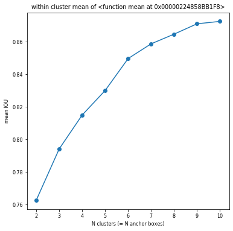
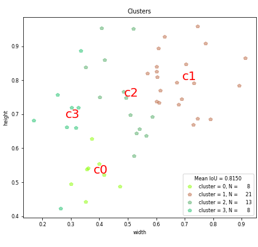
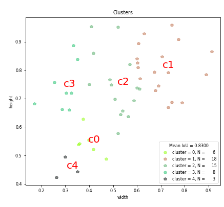
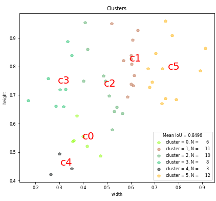

## Task 1 - Training ResNet18 on Tiny-ImageNet Dataset from scratch

The model reaches a maximum validation accuracy of **56.23%** on Tiny-ImageNet using **ResNet 18** model.

### Training History

## Part 2 - Finding YOLO v2 Anchor Boxes

Finding anchor boxes for a dataset of 50 dog images using **K-Means Clustering Algorithm**.

### Mean IoU vs Clusters

For the dataset created, it was found that the most suitable number of clusters could be 6.

| Number of Clusters (k) | Mean IoU |             Cluster Plot            |
| :--------------------: | :------: | :---------------------------------: |
|           4            |   0.81   |  |
|           5            |   0.83   |  |
|           6            |   0.85   |  |
