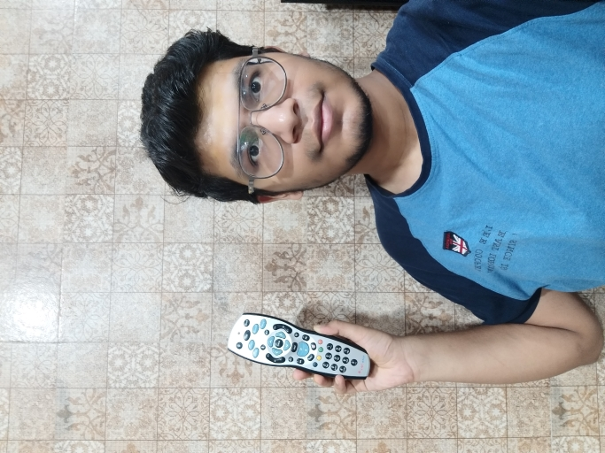
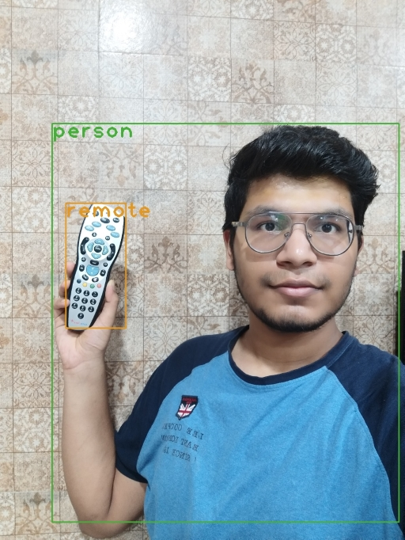

## YOLO object detection usingh openCV
This project is an implementation of the object detection using openCV. For detailed explanation, this <a href="https://pysource.com/2019/06/27/yolo-object-detection-using-opencv-with-python/" target="_blank">blog</a> can be referred.

Due to large size, I haven't uploaded the weights file.

## Examples
> On me... 😎
| Raw | Detected |
|:---:|:--------:|
|||
