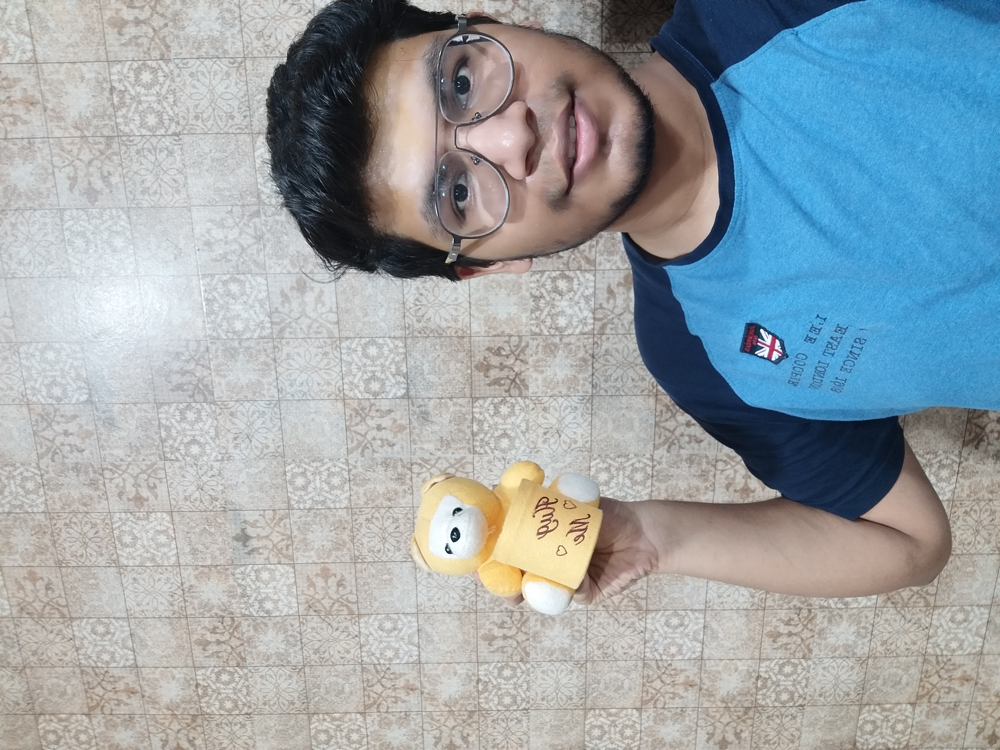
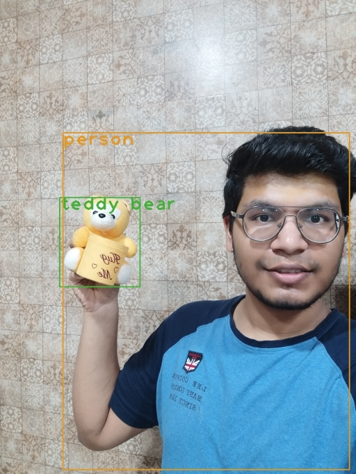
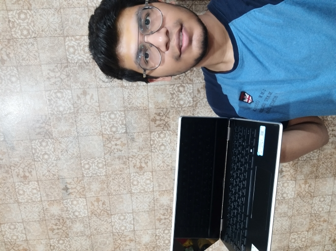
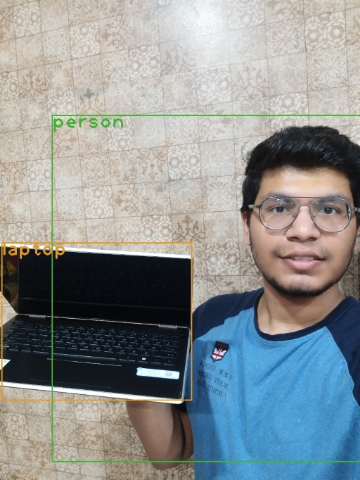

## YOLO object detection usingh openCV
This project is an implementation of the object detection using openCV. For detailed explanation, this <a href="https://pysource.com/2019/06/27/yolo-object-detection-using-opencv-with-python/" target="_blank">blog</a> can be referred.

- Due to large size, I haven't uploaded the weights file.
- The Script `yolo_objection_detection.py` takes in the saved image and shows the detected object.
- The Script `yolo_live.py` takes the input from the live cam and shows the detected object, live!

## Setup
> For performing detection on saved image, change the name of the image in the script and run:
```
$ python yolo_object_detection.py
```
> For performing detection live:
```
$ python yolo_live.py
```

## Examples
> On me... 😎

| Raw | Detected |
| :---: | :--------: |
|  |  |
|  |  |
|  |  |
